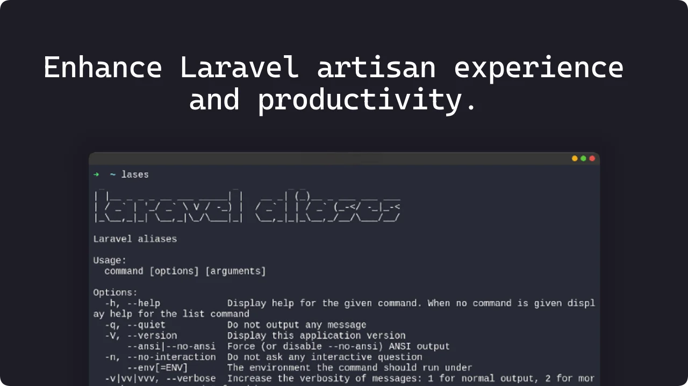

<p align="center">
    <a href="https://github.com/migueweb/laravel-aliases/blob/main/LICENSE">
        
    </a>
</p>

# Laravel aliases

Terminal tool to enhance laravel artisan experience and productivity.

### Prerequisites

- Bash or Zsh shell
- PHP
- curl
- unzip

### Installation

```bash
sh -c "$(curl -fsSL https://raw.githubusercontent.com/migueweb/laravel-aliases/main/install.sh)"
```

## Usage

Commands have a default structure in which they take the first two letters of the original artisan command group and the first three letters of the command, but there are exceptions, for example commands that only take the first two letters or the first three letters of the original or others that add three extra letters at the end.

### Example

`php artisan cache:clear`
cache is the command group and clear is the command and `ca:cle` is the Laravel aliases equivalent

### Commands

| Artisan      | Laravel aliases |
| ------------ | --------------- |
| auth         | au              |
| cache        | ca              |
| config       | co              |
| db           | db              |
| env          | en              |
| event        | ev              |
| jetstream    | je              |
| lang         | la              |
| livewire     | li              |
| make         | m               |
| migrate      | mi              |
| model        | mo              |
| notification | no              |
| optimize     | op              |
| package      | pa              |
| queue        | q               |
| route        | r               |
| sail         | sa              |
| sanctum      | san             |
| schedule     | sch             |
| session      | se              |
| storage      | st              |
| stub         | st              |
| vendor       | ve              |
| view         | vi              |


If you want to use commands without group like serve, migrate, tinker, etc. You can use `art` before of command, this is an equivalent to `php artisan`. Example `art serve` equivalent to `php artisan serve`

### Extra commands

| Laravel Aliases | Artisan                                                    |
| --------------- | ---------------------------------------------------------- |
| `mc Example`    | `php artisan make:controller ExampleController`            |
| `mcr Example`   | `php artisan make:controller ExampleController --resource` |
| `mf Example`    | `php artisan make:factory ExampleFactory`                  |
| `mmg examples`  | `php artisan make:migration create_examples_table`         |
| `mrq Example`   | `php artisan make:request ExampleRequest`                  |
| `ms Example`    | `php artisan make:seeder ExampleSeeder`                    |
| `mfs`           | `php artisan migrate:fresh --seed`                         |
| `rl`            | `php artisan route:list`                                   |
| `key`           | `php artisan key:generate`                                 |

## 🤝 Contributing

Hey if you want to add more documentation, aliases, functions, improve the code or report issues, you are welcome. Please see 😉👉 [contributing.md](CONTRIBUTING.md) for details.
